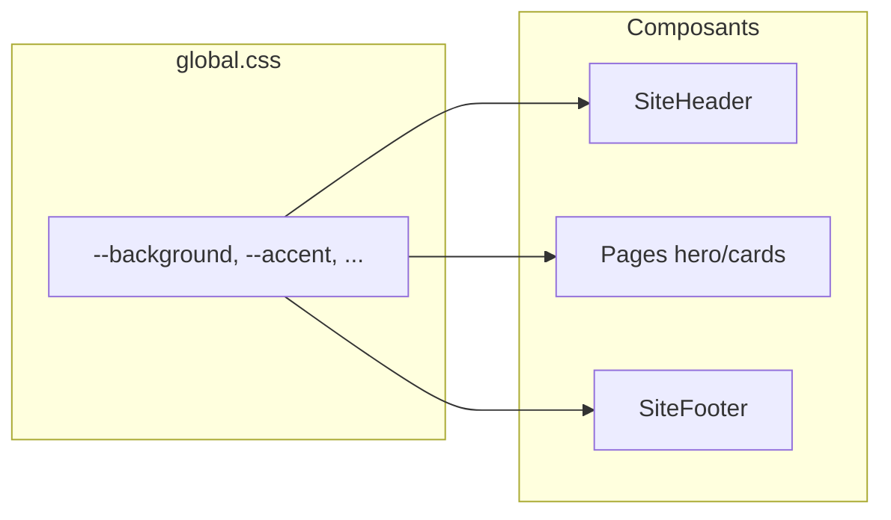

# Mise en conformité charte graphique ACCTE

## État actuel

Le site est un site **Astro statique** sans Tailwind. Toute la palette passe par **6 variables CSS** dans [`src/styles/global.css`](src/styles/global.css) :

```1:8:src/styles/global.css
:root {
  color-scheme: light dark;
  --background: #f7f4ef;
  --foreground: #191612;
  --muted: #625a51;
  --surface: #fffaf2;
  --accent: #8a4f2b;
  --accent-contrast: #fff8ef;
```

L’en-tête affiche uniquement du **texte** ([`src/components/SiteHeader.astro`](src/components/SiteHeader.astro)) ; le seul visuel de marque est un favicon provisoire ([`public/favicon.svg`](public/favicon.svg)).



---

## Assets reçus

### Logo header (fourni)

| Propriété | Valeur |
|-----------|--------|
| Fichier source | `assets/logo-c130f5f4-93bb-40c9-a945-75f85cc4e357.png` (workspace Cursor) |
| Destination impl. | `public/logo.png` |
| Format | PNG RGBA, **353 × 120 px** |
| Contenu | Pictogramme (3 figures + horloge) + texte complet sur 3 lignes |
| Usage header | **Logo seul** — remplacer le bloc texte actuel (`ACCTE` + tagline) |


### Pictogramme / favicon (fourni)

| Propriété | Valeur |
|-----------|--------|
| Fichier source | `assets/picto-5ac18cb2-2a94-4411-98fd-d7b8581eba7c.png` |
| Destination impl. | `public/favicon.png` (+ éventuellement `apple-touch-icon.png`) |
| Format | PNG RGBA, **120 × 120 px** (carré) |
| Contenu | 3 figures + horloge, sans texte |
| Usage | Favicon onglet navigateur ; remplace le SVG provisoire « A » marron |

Mise à jour [`src/layouts/BaseLayout.astro`](src/layouts/BaseLayout.astro) :

```html
<link rel="icon" type="image/png" href="/favicon.png" />
```

**Note fond :** si le PNG a un fond noir opaque (et non transparent), le favicon s’affichera correctement ; sur le site en fond clair, vérifier à l’implémentation que le logo horizontal n’affiche pas de cadre noir indésirable — sinon demander une exportation fond transparent.

### Palette officielle (fournie)

| Nom charte | HEX | Rôle charte | Token / usage site |
|------------|-----|-------------|-------------------|
| Rose Magenta | `#D81B60` | Titres de rubriques, structure, contours | `--accent` ; `.eyebrow` ; `h2` des sections ; bordure `.note-box` ; nav active ; titres cartes au survol |
| Vert Feuillage | `#4A7C44` | Puces de listes, accents pictogramme | `--accent-green` (nouveau) ; `::marker` des listes dans `.content-section` |
| Bleu Ciel | `#81D4FA` | Fonds de texte, détails | `--accent-sky` (nouveau) ; dégradé léger du `body` ; fonds d’accentuation (hero, encarts) |
| Bleu Marine Institutionnel | `#001D4A` | Texte principal, logos pied de page | `--foreground` ; liens footer ; texte corps |

**Couleurs dérivées** (non fournies par la charte — choix d’implémentation cohérents) :

| Token | Valeur proposée | Justification |
|-------|-----------------|---------------|
| `--background` | `#ffffff` | Fond institutionnel neutre |
| `--surface` | `#f0f9fd` | Teinte très légère du bleu ciel (~12 %) |
| `--muted` | `#3d5a73` | Bleu marine atténué (~55 % luminosité) pour texte secondaire |
| `--accent-contrast` | `#ffffff` | Texte sur boutons / skip-link magenta |

**Mode sombre :** la charte ne définit pas de variantes sombres → **mode clair uniquement** (`color-scheme: light`, suppression du `@media (prefers-color-scheme: dark)`).

**Assets : complets** (logo, picto, palette).

---

## Comment nous transmettre les images

**Option recommandée — glisser-déposer dans le chat Cursor**

1. Joignez ici les fichiers (logo principal, variante si existante, icône seule pour favicon).
2. Indiquez en une phrase l’usage de chaque fichier (ex. « logo horizontal pour le header », « pictogramme pour l’onglet »).
3. Listez les **codes hex** de la charte (primaire, secondaire, fond, texte) — vous avez indiqué pouvoir les fournir.

**Option alternative — déposer dans le projet**

Placez les fichiers dans [`public/`](public/) avec des noms explicites, par exemple :

| Fichier suggéré | Usage |
|-----------------|--------|
| `public/logo.svg` | Logo header (priorité **SVG**) |
| `public/logo.png` | Secours si pas de SVG (fond transparent) |
| `public/logo-icon.svg` | Version compacte / favicon |
| `public/logo-dark.svg` | Variante pour fond sombre (si la charte le prévoit) |

**Formats attendus**

- **SVG** de préférence (net à toute taille, poids faible).
- **PNG** avec transparence si pas de SVG (hauteur cible ~80–120 px pour le header).
- Évitez JPG pour un logo (pas de transparence).

**Ce qui nous aide en plus**

- Une capture ou extrait PDF de la charte (couleurs + espacements autour du logo).
- Règles d’usage : logo seul vs logo + baseline, marges minimales, fonds interdits.

---

## Plan d’implémentation technique

### 1. Mettre à jour les tokens CSS

Dans [`src/styles/global.css`](src/styles/global.css), remplacer `:root` par :

```css
:root {
  color-scheme: light;
  --background: #ffffff;
  --foreground: #001d4a;
  --muted: #3d5a73;
  --surface: #f0f9fd;
  --accent: #d81b60;
  --accent-green: #4a7c44;
  --accent-sky: #81d4fa;
  --accent-contrast: #ffffff;
}
```

Actions complémentaires :

- **Dégradé `body`** : `radial-gradient(..., rgba(129, 212, 250, 0.35), transparent)` (bleu ciel) au lieu du marron actuel.
- **Supprimer** le bloc `@media (prefers-color-scheme: dark)` dans `global.css` et `site.css`.
- **Rubriques** : `.eyebrow`, `.content-section h2`, `.site-footer__heading` → `var(--accent)` (magenta).
- **Listes** : ajouter dans `site.css` pour `.content-section ul` : `list-style: disc` + `::marker { color: var(--accent-green); }`.
- **Hero / cartes** : fonds avec `color-mix(in srgb, var(--accent-sky) 15–25%, var(--surface))`.
- **Contraste** : vérifier skip-link magenta/blanc et texte marine sur fond blanc (WCAG AA).

### 2. Copier le logo et centraliser la config

- Copier le PNG fourni vers `public/logo.png`.
- Étendre [`src/data/site.ts`](src/data/site.ts) :

```ts
logo: {
  src: "/logo.png",
  alt: "Association de la Convention Citoyenne sur les temps de l'enfant",
  width: 353,
  height: 120,
},
```

Le `alt` reprend le nom complet (le logo est décoratif + informatif ; une seule mention textuelle suffit).

### 3. Intégrer le logo dans l’en-tête (logo seul)

Modifier [`src/components/SiteHeader.astro`](src/components/SiteHeader.astro) :

- **Supprimer** les `<span class="site-brand__name">` et `__tagline` — le visuel contient déjà tout le texte.
- Lien d’accueil = `` uniquement, avec `width` / `height` natifs pour éviter le layout shift.

Styles dans [`src/styles/site.css`](src/styles/site.css) (section `.site-brand`) :

- Hauteur cible : **~48 px** desktop (`max-height: 3rem`), **~40 px** mobile.
- Largeur auto via ratio 353:120 (`width: auto`).
- `object-fit: contain`.
- Sur petits écrans : le header peut passer en colonne (déjà en `flex-wrap`) — vérifier que le logo reste lisible sans déborder.

### 4. Favicon et métadonnées

- Copier le pictogramme fourni (120×120) vers `public/favicon.png`.
- Remplacer le lien `favicon.svg` actuel par `type="image/png"` dans `BaseLayout.astro`.
- Supprimer ou conserver `public/favicon.svg` (obsolète après bascule).
- Optionnel : générer `apple-touch-icon.png` (180×180) par redimensionnement du picto si besoin iOS.

### 5. Footer

- Texte en `--foreground` (bleu marine `#001D4A`) — conforme à la charte (« texte principal et logos en bas de page »).
- Rubriques « Contact » / « Réseaux sociaux » en magenta (`--accent`) comme titres de rubriques.
- Optionnel : petit pictogramme ou logo horizontal réduit — non requis pour la v1.

### 6. Vérification visuelle

- `yarn dev` puis contrôle des 3 pages : `/`, `/association/`, `/membres/`.
- Test responsive (header wrap, logo lisible).
- Test contraste (magenta, marine, vert sur fond clair).
- Test favicon dans l’onglet navigateur.

---

## Fichiers touchés (résumé)

| Fichier | Changement |
|---------|------------|
| `public/logo.png` | Logo horizontal header (353×120, fourni) |
| `public/favicon.png` | Pictogramme 120×120 (fourni) |
| [`src/styles/global.css`](src/styles/global.css) | Palette charte |
| [`src/data/site.ts`](src/data/site.ts) | Config logo + éventuellement couleurs documentées |
| [`src/components/SiteHeader.astro`](src/components/SiteHeader.astro) | Affichage logo |
| [`src/styles/site.css`](src/styles/site.css) | Layout marque |
| [`public/favicon.svg`](public/favicon.svg) | Icône officielle |
| [`src/layouts/BaseLayout.astro`](src/layouts/BaseLayout.astro) | Favicon si format multiple |
| [`src/components/SiteFooter.astro`](src/components/SiteFooter.astro) | Optionnel |

Aucun changement de structure de pages ni de contenu éditorial — uniquement identité visuelle.

---

## Prochaine étape

**Tout est prêt pour l’implémentation** (logo, picto, 4 couleurs officielles + dérivés documentés).

Dites **« exécute le plan »** ou **« vas-y »** pour appliquer les changements au code.
