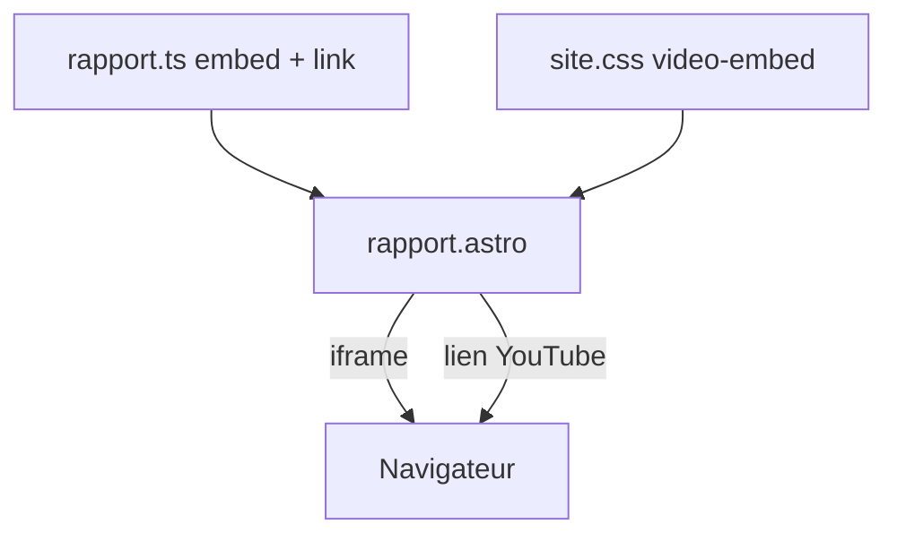

# Embed vidéo YouTube sur la page Rapport

## État actuel

La section `video` dans `[src/data/rapport.ts](src/data/rapport.ts)` ne contient qu’un lien vers `https://www.youtube.com/live/wOgXeZP4ei0`. Le template `[src/pages/rapport.astro](src/pages/rapport.astro)` affiche uniquement paragraphes + liens (`content-link`). Aucun style vidéo dans `[src/styles/site.css](src/styles/site.css)`.

## Modifications prévues

### 1. Données — `[src/data/rapport.ts](src/data/rapport.ts)`

Étendre la section `video` avec un champ `embed` (réservé à cette section) :

```ts
{
  id: "video",
  title: "Vidéo de présentation",
  paragraphs: [ /* inchangé */ ],
  embed: {
    src: "https://www.youtube.com/embed/wOgXeZP4ei0?si=szkTJvbNRl70DTpc",
    title: "Présentation du rapport citoyen sur YouTube",
  },
  links: [
    {
      label: "Voir la vidéo de présentation du rapport (YouTube)",
      href: "https://www.youtube.com/watch?v=wOgXeZP4ei0",
    },
  ],
},
```

- **Embed** : URL fournie par l’utilisateur (`/embed/wOgXeZP4ei0?si=…`).
- **Lien externe** : passer de `/live/…` à `/watch?v=wOgXeZP4ei0` (même vidéo, URL stable pour l’ouverture dans un nouvel onglet).

### 2. Template — `[src/pages/rapport.astro](src/pages/rapport.astro)`

Après les paragraphes, avant les `links`, rendre l’iframe si la section a un `embed` :

```astro
{"embed" in section && section.embed && (
  <figure class="video-embed">
    <iframe
      src={section.embed.src}
      title={section.embed.title}
      loading="lazy"
      allow="accelerometer; autoplay; clipboard-write; encrypted-media; gyroscope; picture-in-picture; web-share"
      referrerpolicy="strict-origin-when-cross-origin"
      allowfullscreen
    />
  </figure>
)}
```

- Pas d’attribut `frameborder` (obsolète) : bordure gérée en CSS.
- `figure` + `title` sur l’iframe pour l’accessibilité (titre en français plutôt que « YouTube video player »).

### 3. Styles — `[src/styles/site.css](src/styles/site.css)`

Ajouter un conteneur responsive 16:9, largeur alignée sur le corps de texte (`max-width: 42rem`) :

```css
.video-embed {
  margin: 0 0 1.25rem;
  max-width: 42rem;
  aspect-ratio: 16 / 9;
}

.video-embed iframe {
  display: block;
  width: 100%;
  height: 100%;
  border: 0;
}
```

## Flux




## Vérification

- `yarn build` sans erreur.
- `/rapport/` : lecteur visible sous le texte d’intro ; lien « YouTube » ouvre la vidéo dans un nouvel onglet.
- Redimensionnement : iframe reste proportionnelle (ratio 16:9).
- Pas de modification du fichier plan ni des autres pages.

## Hors scope

- Refactor générique `association.astro` / composant partagé pour les embeds.
- Autres sections avec iframe.

