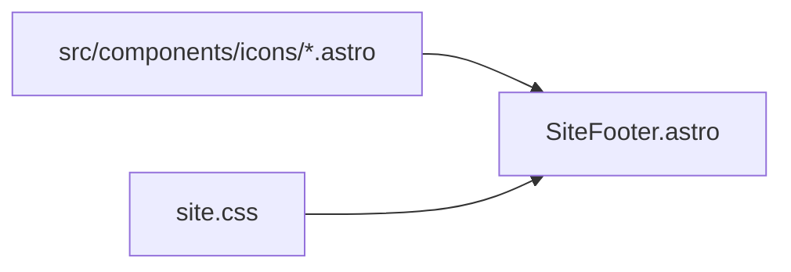

# Icônes email et réseaux dans le footer

## Contexte

Le footer actuel (`[src/components/SiteFooter.astro](src/components/SiteFooter.astro)`) affiche des liens texte uniquement :

```14:42:src/components/SiteFooter.astro
    <motion class="site-footer__contact">
      <h2 class="site-footer__heading">Contact</h2>
      <a class="site-footer__link" href={`mailto:${site.contactEmail}`}>
        {site.contactEmail}
      </a>
    </motion>
    ...
            LinkedIn
    ...
            Instagram
```

- Pas de librairie d’icônes ni de composants SVG existants.
- Charte : liens footer en `--foreground` (`#001D4A`) — **icônes monochromes** via `currentColor` (choix validé).
- Site statique Astro, zéro JS client : SVG inline uniquement.




---

## Approche retenue

### 1. Composants icônes SVG (3 fichiers)

Créer `[src/components/icons/](src/components/icons/)` avec de petits composants Astro réutilisables :


| Fichier               | Rôle                          |
| --------------------- | ----------------------------- |
| `IconEmail.astro`     | Enveloppe générique (contact) |
| `IconLinkedIn.astro`  | Logo LinkedIn reconnaissable  |
| `IconInstagram.astro` | Logo Instagram reconnaissable |


Conventions communes pour chaque icône :

- `viewBox="0 0 24 24"`, taille via classe CSS (pas de dimensions fixes en dur dans le SVG).
- `fill="currentColor"` pour hériter du bleu marine du lien parent.
- `aria-hidden="true"` (le texte du lien reste l’étiquette accessible).
- `focusable="false"` pour éviter le focus parasite sous IE/SVG legacy.

Chemins SVG : formes standard type Simple Icons (monochrome), suffisantes pour reconnaissance de marque sans couleurs propriétaires.

### 2. Mettre à jour `[SiteFooter.astro](src/components/SiteFooter.astro)`

- Importer les 3 composants icônes.
- Envelopper chaque lien avec une structure **icône + texte** :

```astro
<a class="site-footer__link site-footer__link--icon" href={`mailto:${site.contactEmail}`}>
  <IconEmail />
  <span>{site.contactEmail}</span>
</a>
```

Même pattern pour LinkedIn et Instagram (`<span>LinkedIn</span>`, `<span>Instagram</span>`).

- Conserver `rel="noopener noreferrer"` et `target="_blank"` sur les réseaux sociaux.
- Aucun changement requis dans `[src/data/site.ts](src/data/site.ts)` (URLs et email déjà centralisés).

### 3. Styles — `[src/styles/site.css](src/styles/site.css)`

Ajouter / ajuster :

```css
.site-footer__link--icon {
  display: inline-flex;
  align-items: center;
  gap: 0.5rem;
}

.site-footer__link--icon svg {
  flex-shrink: 0;
  width: 1.25rem;
  height: 1.25rem;
}

.site-footer__link--icon:hover svg,
.site-footer__link--icon:focus-visible svg {
  /* hérite déjà de currentColor via le lien */
}
```

- `.site-footer__social-list` : conserver colonne verticale (chaque ligne = icône + label).
- Survol / focus : le lien garde `color: var(--foreground)` ; pas de soulignement sous l’icône seule (soulignement sur le lien entier ou sur le `span` texte si besoin d’affiner).

### 4. Accessibilité

- Liens inchangés sémantiquement : texte visible = nom du réseau / adresse email.
- Icônes décoratives (`aria-hidden`).
- Zone cliquable suffisante grâce au `gap` et au padding implicite du lien.

### 5. Documentation (optionnelle, légère)

Une ligne dans `[docs/charte-graphique.md](docs/charte-graphique.md)` : icônes footer monochromes dans `src/components/icons/`, couleur via `currentColor` / `--foreground`.

---

## Fichiers touchés


| Fichier                                    | Action                            |
| ------------------------------------------ | --------------------------------- |
| `src/components/icons/IconEmail.astro`     | Créer                             |
| `src/components/icons/IconLinkedIn.astro`  | Créer                             |
| `src/components/icons/IconInstagram.astro` | Créer                             |
| `src/components/SiteFooter.astro`          | Icônes + structure lien           |
| `src/styles/site.css`                      | Styles `.site-footer__link--icon` |
| `docs/charte-graphique.md`                 | Mention courte (optionnel)        |


Pas de nouveau package, pas de fichiers dans `public/`.

---

## Vérification

- `yarn build` OK.
- `yarn dev` : footer sur les 3+ pages avec layout partagé (`PageLayout`).
- Contrôle visuel : icônes alignées, lisibles, couleur marine.
- Tabulation clavier : focus visible sur chaque lien.
- Lecteur d’écran : annonce « LinkedIn », « Instagram », adresse email (texte inchangé).

