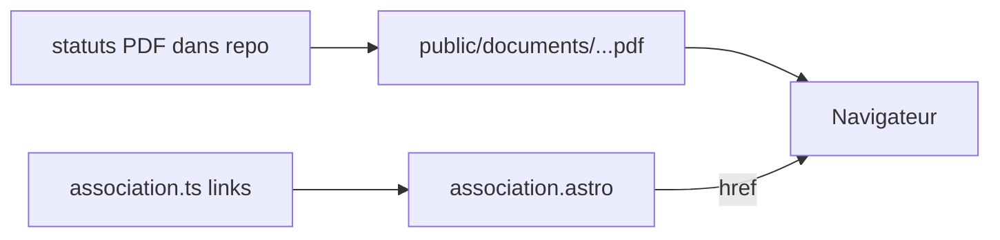

# Lien vers les statuts sur la page L'association

## Contexte technique

- La page `/association/` lit tout le contenu depuis `[src/data/association.ts](src/data/association.ts)` et ne gère aujourd’hui que du texte (`paragraphs`) ou des cartes (`items`), sans liens dans le corps (`[src/pages/association.astro](src/pages/association.astro)`).
- Aucun PDF n’est versionné pour l’instant ; le site statique Astro sert les fichiers placés sous `[public/](public/)` à la racine URL (ex. `public/documents/foo.pdf` → `/documents/foo.pdf`).
- Le fichier fourni hors dépôt : `…/Documents/CCTE/Asso/Statuts Association ACCTE.pdf` — à copier dans le repo avec un **nom d’URL sans espaces** (recommandé : `public/documents/statuts-association-accte.pdf`) pour éviter l’encodage `%20` et les problèmes de partage.

## Modifications prévues

1. **Asset**
  - Créer `public/documents/` et y placer le PDF (copie depuis le chemin Documents), nom final suggéré : `statuts-association-accte.pdf`.
2. **Données** (`[src/data/association.ts](src/data/association.ts)`)
  - Ajouter une section dédiée (titre **« Statuts de l’association »**) avec un court paragraphe d’introduction.  
  - Étendre le type des sections « texte » avec un champ optionnel `links`, par exemple :
    - `{ label: "…", href: "/documents/statuts-association-accte.pdf" }`
  - Libellé du lien : mention explicite **PDF** pour l’accessibilité et la clarté (ex. « Consulter les statuts (PDF) ») et de la taille do document (137 ko).
3. **Template** (`[src/pages/association.astro](src/pages/association.astro)`)
  - Dans la branche des sections à `paragraphs`, après les `
`, si `'links' in section` et tableau non vide : rendre un ou plusieurs liens `<a href={…}>` avec `rel="noopener noreferrer"` et `target="_blank"` (ouverture dans un nouvel onglet, comportement habituel pour un PDF).
4. **Styles** (`[src/styles/site.css](src/styles/site.css)`)
  - Ajouter une classe légère du type `.content-link` (souligné, `font-weight: 600`, couleur lisible — alignée sur `.site-footer__link` / charte ACCTE) et l’appliquer aux liens de section pour qu’ils ne restent pas en `color: inherit` peu visible.

## Schéma du flux

## Mise à jour README

- **Ajouter** info sur traitement du document

