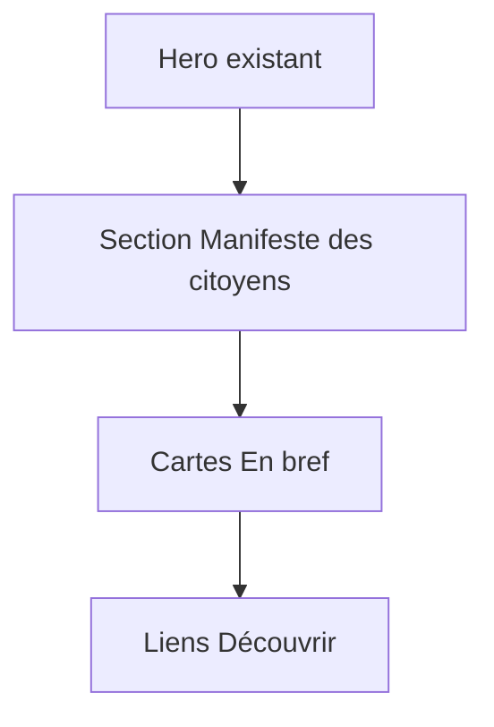

# Ajouter le manifeste des citoyens sur l'accueil

## Contexte

La page d'accueil (`[src/pages/index.astro](src/pages/index.astro)`) s'appuie sur `[src/data/home.ts](src/data/home.ts)` et affiche aujourd'hui : hero, cartes « En bref », liens « Découvrir ». Les pages de contenu long (ex. `[src/pages/rapport.astro](src/pages/rapport.astro)`) stockent le texte dans un fichier `data/*.ts` sous forme de tableaux `paragraphs` et le rendent avec la classe `.content-section` déjà définie dans `[src/styles/site.css](src/styles/site.css)`.

## Structure du contenu

Le texte fourni sera découpé ainsi :


| Rôle       | Contenu                                                                                        |
| ---------- | ---------------------------------------------------------------------------------------------- |
| Titre      | *Investir dans l'enfance, c'est bâtir l'avenir.*                                               |
| Corps      | 17 paragraphes (séparateurs = double saut de ligne ; lignes simples fusionnées avec un espace) |
| Conclusion | *Prenons soin de nos enfants.*                                                                 |


Paragraphes du corps (après fusion des retours simples) :

1. Dans une société qui doit s'adapter… Il faut changer cela.
2. Un enfant épanoui et protégé… sont affectés.
3. Cette situation est inacceptable.
4. La force de notre convention… la cohésion s'est faite.
5. À nos voix viennent s'ajouter… dans notre travail.
6. Nous avons également rencontré… des territoires…
7. Merci à eux.
8. Ces différentes interventions ont alimenté nos réflexions.
9. Nous avons discuté… ne doivent plus être morcelés.
10. Nos propositions sont le fruit… actions concrètes.
11. Dépassons tous les clivages… société tout entière.
12. Nous savons que de nombreux acteurs… soutenus rapidement.
13. Plusieurs de nos propositions… professionnels de l'enfance.
14. Que sont devenus ces apports sur le terrain ?
15. Il est impératif… il est atteignable.
16. Nous, citoyennes et citoyens… qui nous a été confiée.
17. Notre rapport ne doit pas… au service du bien commun.
18. Nos enfants – tous les enfants… de les défendre.

*(Le paragraphe 18 précède la conclusion, conformément au texte source.)*

Typographie : conserver le texte tel quel (apostrophes droites `'` comme dans les autres fichiers `src/data/`).

## Modifications prévues

### 1. Données — `[src/data/home.ts](src/data/home.ts)`

Ajouter un objet `manifeste` :

```ts
manifeste: {
  eyebrow: "Manifeste des citoyens",
  title: "Investir dans l'enfance, c'est bâtir l'avenir.",
  paragraphs: [ /* 18 chaînes */ ],
  conclusion: "Prenons soin de nos enfants.",
},
```

### 2. Template — `[src/pages/index.astro](src/pages/index.astro)`

Insérer une section **entre le hero et les highlights** (visibilité immédiate du manifeste sans noyer le hero existant) :

```astro
<section
  class="content-section manifeste"
  id="manifeste"
  aria-labelledby="manifeste-title"
>
  <p class="eyebrow">{homePage.manifeste.eyebrow}</p>
  <h2 id="manifeste-title">{homePage.manifeste.title}</h2>
  {homePage.manifeste.paragraphs.map((paragraph) => <p>{paragraph}</p>)}
  <p class="manifeste__conclusion">{homePage.manifeste.conclusion}</p>
</section>
```

- `id="manifeste"` permet un lien d'ancrage si besoin plus tard.
- L'eyebrow reprend le pattern du hero (classe `.eyebrow` déjà en place).

### 3. Styles — `[src/styles/site.css](src/styles/site.css)`

Ajouts légers, alignés sur la charte :

- `.manifeste h2` : titre du manifeste en `var(--accent)` (comme les autres `h2` de `.content-section`), taille légèrement supérieure si le titre long le justifie (`max-width` un peu plus large que `42rem` pour éviter des césures trop serrées).
- `.manifeste__conclusion` : phrase de clôture en `var(--foreground)`, `font-weight: 700`, marge supérieure un peu plus marquée pour la distinguer du dernier paragraphe du corps.

Pas de nouveau token couleur ; réutilisation de `--accent`, `--foreground`, `--muted`.

## Flux visuel (après implémentation)




## Vérification manuelle

- Ouvrir `/` en dev : le manifeste apparaît sous le hero, paragraphes aérés, pas de coupures de ligne artificielles au milieu des phrases.
- Vérifier la conclusion visuellement distincte en bas de section.
- Contrôle responsive : `max-width` du texte lisible sur mobile.
- Pas de changement de `description` SEO nécessaire (le manifeste enrichit la page sans remplacer le hero).

## Fichiers touchés


| Fichier                                          | Action                                         |
| ------------------------------------------------ | ---------------------------------------------- |
| `[src/data/home.ts](src/data/home.ts)`           | Ajouter `manifeste` avec tout le texte formaté |
| `[src/pages/index.astro](src/pages/index.astro)` | Nouvelle section entre hero et highlights      |
| `[src/styles/site.css](src/styles/site.css)`     | Styles `.manifeste` / `.manifeste__conclusion` |


Aucun autre fichier requis.