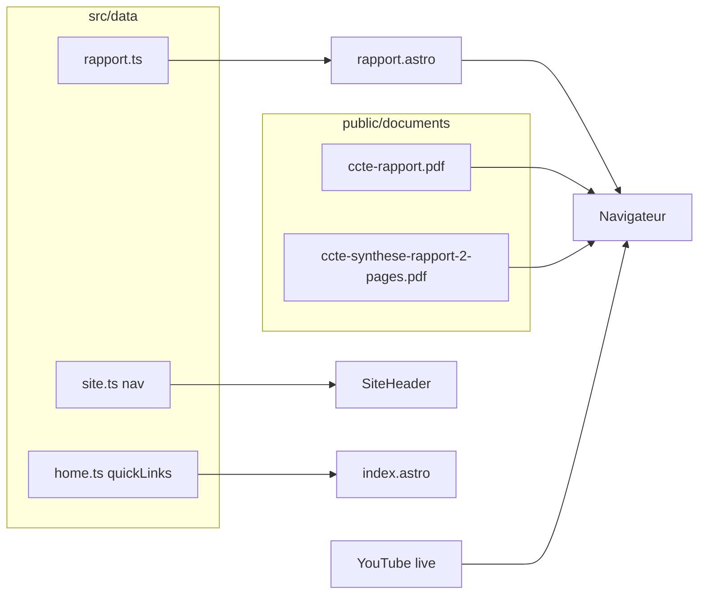

# Page Rapport citoyen

## Contexte

Le site est un **Astro statique** avec contenus dans `[src/data/](src/data/)` et pages dans `[src/pages/](src/pages/)`. Les PDF sont versionnés sous `[public/documents/](public/documents/)` et servis à `/documents/<fichier>` — déjà en place pour les statuts (`[src/data/association.ts](src/data/association.ts)`, lien vers `statuts-association-accte.pdf`).

Fichiers source (hors dépôt) à intégrer :

| Source | Taille | Destination proposée |
|--------|--------|----------------------|
| `…/CCTE/CCTE-Rapport-citoyen.pdf` | ~4,7 Mo | `public/documents/ccte-rapport.pdf` |
| `…/01_Synthèses/Synthèse 2 pages.pdf` | ~138 ko | `public/documents/ccte-synthese-rapport-2-pages.pdf` |

Noms **sans espaces ni accents** pour des URL propres. Le segment `rapport-citoyen` est évité dans les chemins et noms de fichiers ; le libellé complet **« Rapport citoyen »** reste réservé au texte visible (menu, titres, liens d’action).

Choix confirmés : libellé menu **« Rapport citoyen »**, route **`/rapport/`**, et **carte sur l’accueil**.

## Convention de nommage

| Élément | Valeur |
|---------|--------|
| Route | `/rapport/` |
| Page Astro | `src/pages/rapport.astro` |
| Données | `src/data/rapport.ts` |
| PDF rapport complet | `public/documents/ccte-rapport.pdf` → `/documents/ccte-rapport.pdf` |
| PDF synthèse | `public/documents/ccte-synthese-rapport-2-pages.pdf` → `/documents/ccte-synthese-rapport-2-pages.pdf` |
| Texte visible (titre page, nav, accueil) | **Rapport citoyen** |
| Libellé lien PDF (corps de page) | ex. « Consulter le rapport citoyen (PDF, ~4,7 Mo) » — formulation utilisateur, pas un chemin |
| Vidéo YouTube (externe) | `https://www.youtube.com/live/wOgXeZP4ei0` — lien dans `rapport.ts`, pas de fichier local |

## Architecture



## Implémentation

### 1. Assets PDF

- Copier `CCTE-Rapport-citoyen.pdf` vers `public/documents/ccte-rapport.pdf` (renommage à la copie, pas de `rapport-citoyen` dans le nom final).
- Copier `Synthèse 2 pages.pdf` vers `public/documents/ccte-synthese-rapport-2-pages.pdf`.
- Versionner dans git comme le statuts existant (~4,8 Mo au total).

### 2. Données — `[src/data/rapport.ts](src/data/rapport.ts)` (nouveau)

Structure calquée sur `[association.ts](src/data/association.ts)` :

- `title`: « Rapport citoyen » (texte visible)
- `description`: chapô court (résultat de la Convention citoyenne sur les temps de l’enfant, travail des participant·es).
- `sections` avec `id`, `title`, `paragraphs`, et `links` optionnels :

| Section | Contenu |
|---------|---------|
| `presentation` | Contexte : le rapport formalise les travaux et propositions de la convention. |
| `synthese` | Présentation de la synthèse 2 pages comme entrée rapide. Lien : `Consulter la synthèse (PDF, 2 pages, 138 ko)` → `/documents/ccte-synthese-rapport-2-pages.pdf` |
| `rapport-complet` | Invitation à lire le document intégral. Lien : `Consulter le rapport citoyen (PDF, ~4,7 Mo)` → `/documents/ccte-rapport.pdf` |

Textes rédigés dans le ton des pages existantes (`[association.ts](src/data/association.ts)`). À l’implémentation, relire rapidement la synthèse PDF pour ajuster 1–2 phrases si des formulations officielles doivent être reprises.

### 3. Page — `[src/pages/rapport.astro](src/pages/rapport.astro)` (nouveau)

- Reprendre le template de `[association.astro](src/pages/association.astro)` : `PageLayout`, en-tête `page-header`, boucle sur `sections` avec rendu `paragraphs` + `links` (`class="content-link"`, `target="_blank"`, `rel="noopener noreferrer"`).
- **Pas de nouveau composant partagé** pour limiter la portée du diff.

### 4. Navigation — `[src/data/site.ts](src/data/site.ts)`

Ajouter dans `nav` (après « L'association », avant « Les membres ») :

```ts
{ label: "Rapport citoyen", href: "/rapport/" },
```

`isActiveNav()` gère déjà les préfixes d’URL.

### 5. Accueil — `[src/data/home.ts](src/data/home.ts)`

Ajouter dans `quickLinks` :

```ts
{
  label: "Rapport citoyen",
  href: "/rapport/",
  description: "Vidéo, synthèse et rapport complet de la convention.",
},
```

### 6. Documentation — `[README.md](README.md)`

- Ajouter la ligne `/rapport/` dans le tableau des routes.
- Mentionner `rapport.ts` dans la liste des fichiers de données.
- Documenter `ccte-rapport.pdf` et `ccte-synthese-rapport-2-pages.pdf` dans la section `public/documents/`.

## Hors scope (sauf demande)

- Lien croisé depuis la section « Le contexte de la convention » sur `/association/`.
- Prévisualisation PDF embarquée ou iframe.
- Extraction automatique du texte de la synthèse dans le corps HTML.

## Vérification

- `yarn build` — route générée dans `dist/rapport/`.
- `yarn dev` — menu affiche **Rapport citoyen**, URL `/rapport/` ; liens PDF vers `/documents/ccte-rapport.pdf` et `/documents/ccte-synthese-rapport-2-pages.pdf` ; lien YouTube ouvre `https://www.youtube.com/live/wOgXeZP4ei0` dans un nouvel onglet.
- Contrôle accessibilité : libellés de liens explicites (« PDF », « YouTube », taille approximative pour les PDF).
