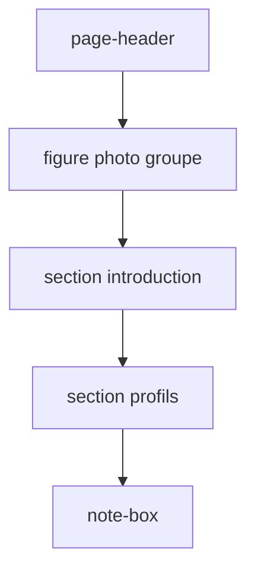

# Photo de groupe sur la page Les membres

## Contexte

- Page actuelle : `[src/pages/membres.astro](src/pages/membres.astro)` — en-tête, section introduction, grille de profils, note.
- Données : `[src/data/membres.ts](src/data/membres.ts)`.
- Photo fournie : image de groupe des citoyen·nes (format **JPEG**, paysage, idéal en pleine largeur). Source Cursor : `Photo_groupe-b079fbd7-ed12-4b14-9127-62628a2023b7.png` — à enregistrer en `**.jpg`** dans `public/` (conversion si le fichier source est encore en PNG).
- Le site sert les images depuis `[public/](public/)` (comme `logo.png`, `documents/`).

## Emplacement proposé

Insérer la photo **entre l’en-tête de page et la section « Qui sont les membres ? »** : le visiteur voit d’abord le titre, puis le groupe réel, puis le texte explicatif. Cela correspond au rôle de la photo (illustrer la diversité et l’échelle du collectif) sans perturber la grille de profils existante.




## Implémentation

### 1. Asset statique

- Copier l’image depuis le dossier Cursor assets vers `**public/images/photo-groupe-citoyens.jpg**` (URL : `/images/photo-groupe-citoyens.jpg`).
- Format de publication : **JPEG** (extension `.jpg`). Si l’asset Cursor est encore en PNG, convertir à la copie (ex. `sips -s format jpeg` sur macOS) pour respecter le format source.
- Créer le dossier `public/images/` si besoin (même logique que `public/documents/`).

### 2. Données (`membres.ts`)

Ajouter un objet `groupPhoto` dans `membresPage` :

```ts
groupPhoto: {
  src: "/images/photo-groupe-citoyens.jpg",
  alt: "Groupe des participant·es de la Convention citoyenne sur les temps de l'enfant, réunis au palais d'Iéna.",
  caption: "Les citoyen·nes participant·es à la Convention citoyenne sur les temps de l'enfant.",
  credit: 'Crédits Katrin Baumann CESE',
},
```

- Texte `alt` descriptif pour l’accessibilité (WCAG).
- `caption` : légende éditoriale sous la photo.
- `credit` : crédit photo obligatoire, affiché tel quel : **Crédits Katrin Baumann CESE**

### 3. Marqueup (`membres.astro`)

Après le `</header>`, ajouter :

```astro
<figure class="group-photo">
  
  <figcaption>
    <span class="group-photo__caption">{membresPage.groupPhoto.caption}</span>
    <span class="group-photo__credit">{membresPage.groupPhoto.credit}</span>
  </figcaption>
</figure>
```

- Lire `width` / `height` réels du fichier au moment de l’implémentation (évite le layout shift).
- `loading="lazy"` : la photo est sous le fold immédiat sur mobile ; acceptable pour ~300 Ko.

### 4. Styles (`site.css`)

Nouvelle classe `**.group-photo**` (sur le modèle de `.video-embed` dans `[src/styles/site.css](src/styles/site.css)`) :

- `margin` aligné avec `.content-section` (ex. `0 0 3rem`).
- `max-width: 100%` (photo paysage : utiliser toute la largeur du contenu).
- `img` : `display: block`, `width: 100%`, `height: auto`, `border-radius: 1rem`, bordure légère via `color-mix(in srgb, var(--foreground) …)` (comme les cartes).
- `figcaption` : bloc sous l’image (`display: flex`, `flex-direction: column`, `gap` léger).
- `.group-photo__caption` : `color: var(--muted)`.
- `.group-photo__credit` : même famille, taille légèrement plus petite (crédit photo distinct de la légende).
- **Aucun hex en dur** — respecter `[.cursor/rules/charte-accte.mdc](.cursor/rules/charte-accte.mdc)`.

### 5. Vérification

- `yarn build` — confirmer que `/membres/` inclut l’image dans le build statique.
- Contrôle visuel : photo nette, légende et crédit « Katrin Baumann CESE » lisibles, pas de débordement horizontal sur mobile.

## Fichiers touchés


| Fichier                                              | Action                                           |
| ---------------------------------------------------- | ------------------------------------------------ |
| `public/images/photo-groupe-citoyens.jpg`            | Créer (JPEG, copie/conversion de l’asset fourni) |
| `[src/data/membres.ts](src/data/membres.ts)`         | Ajouter `groupPhoto`                             |
| `[src/pages/membres.astro](src/pages/membres.astro)` | Afficher `<figure>`                              |
| `[src/styles/site.css](src/styles/site.css)`         | Styles `.group-photo`                            |


## Hors scope (volontairement)

- Conversion WebP / redimensionnement : optionnel plus tard si la taille pose problème au chargement.
- Mise à jour de `docs/charte-graphique.md` : pas nécessaire pour une photo de contenu (la charte documente surtout logo/favicon).

