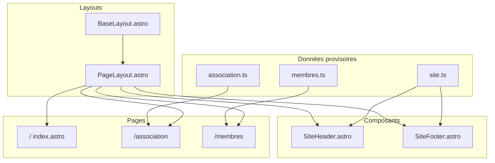

# Structure du site ACCTE

## Contexte actuel

Le projet est minimal : `[src/layouts/BaseLayout.astro](src/layouts/BaseLayout.astro)` (coquille HTML), une seule page `[src/pages/index.astro](src/pages/index.astro)` placeholder, et `[src/styles/global.css](src/styles/global.css)`. Aucun composant partagé ni navigation.

## Architecture proposée




## Arborescence cible

```text
src/
├── components/
│   ├── SiteHeader.astro      # logo/nom + nav principale
│   └── SiteFooter.astro      # contact + réseaux sociaux
├── data/
│   ├── site.ts               # nav, email, URLs sociales, métadonnées
│   ├── association.ts        # textes page Association
│   └── membres.ts            # textes page profil des participants
├── layouts/
│   ├── BaseLayout.astro      # inchangé (head, meta, slot body)
│   └── PageLayout.astro      # header + main + footer
├── pages/
│   ├── index.astro           # Accueil
│   ├── association.astro
│   └── membres.astro
└── styles/
    ├── global.css            # tokens, reset, typo de base
    └── site.css              # header, footer, sections, grilles
```

## Pages et contenu (provisoire)

### 1. Accueil — `/`

- **Hero** : nom ACCTE, sous-titre sur la Convention citoyenne sur les temps de l’enfant.
- **Accroche** : 2–3 phrases sur la mission de l’association.
- **Liens rapides** : cartes ou boutons vers `/association` et `/membres`.
- **Option légère** : bloc « En bref » (3 points : contexte, objectif, engagement citoyen).

### 2. Association — `/association`

- **Qui sommes-nous** : présentation de l’ACCTE.
- **Contexte** : la Convention citoyenne sur les temps de l’enfant.
- **Mission / valeurs** : ce que l’association porte (placeholders structurés).
- Pas de JavaScript client ; HTML sémantique (`section`, `h1`–`h3`).

### 3. Membres — `/membres`

Conformément à ton choix : **profil générique des participants**, pas une liste nominative pour l’instant.

- **Introduction** : qui sont les membres / participants à la convention.
- **Profil des participants** : 3–4 encarts (ex. diversité des parcours, engagement citoyen, regard sur l’enfance, travail collectif) — textes placeholder.
- **Note évolutive** : structure prête pour ajouter plus tard une grille de portraits si besoin (sans l’implémenter maintenant).

## Composants partagés

### `[SiteHeader.astro](src/components/SiteHeader.astro)`

- Nom du site : « ACCTE » + libellé court optionnel.
- Navigation : Accueil, L’association, Les membres.
- Lien actif visuel selon `Astro.url.pathname` (CSS uniquement, pas de JS).
- Lien d’évitement « Aller au contenu » pour l’accessibilité.

### `[SiteFooter.astro](src/components/SiteFooter.astro)`

- Email de contact (`mailto:`) — placeholder : `contact@accte.org` (à remplacer dans `[site.ts](src/data/site.ts)`).
- Liens externes : LinkedIn et Instagram (`rel="noopener noreferrer"`), URLs placeholder.
- Copyright + année courante (générée au build via Astro).
- Rappel du nom complet de l’association.

### `[PageLayout.astro](src/layouts/PageLayout.astro)`

- Enveloppe commune : `BaseLayout` → `SiteHeader` → `<main id="main-content">` → `SiteFooter`.
- Props : `title`, `description` (SEO par page).

## Données centralisées (`[src/data/site.ts](src/data/site.ts)`)

Un seul fichier de configuration pour faciliter les remplacements ultérieurs :

```ts
export const site = {
  name: "ACCTE",
  fullName: "Association de la Convention Citoyenne sur les Temps de l'Enfant",
  contactEmail: "contact@accte.org",
  social: {
    linkedin: "https://www.linkedin.com/company/...",
    instagram: "https://www.instagram.com/...",
  },
  nav: [
    { label: "Accueil", href: "/" },
    { label: "L'association", href: "/association/" },
    { label: "Les membres", href: "/membres/" },
  ],
};
```

Textes longs dans `association.ts` et `membres.ts` pour garder les pages `.astro` lisibles.

## Styles

- Conserver la palette actuelle (tons chauds) dans `[global.css](src/styles/global.css)`.
- Extraire les styles « hero démo Astro » de l’accueil actuel.
- Ajouter `[site.css](src/styles/site.css)` : layout en colonne (`min-height: 100vh`), header sticky ou statique, footer en bas, grilles responsive pour cartes membres/accueil.
- Mobile-first : nav empilée ou menu simple (pas de hamburger JS en v1 — liens visibles ou wrap CSS).

## Suggestions (hors scope immédiat, à valider plus tard)


| Ajout                                               | Intérêt                                                                                           |
| --------------------------------------------------- | ------------------------------------------------------------------------------------------------- |
| Page **Contact** dédiée                             | Formulaire ou formulaire externe ; le footer garde le `mailto:`                                   |
| **Mentions légales** + politique de confidentialité | Recommandé pour une asso française                                                                |
| Bloc **Actualités** sur l’accueil                   | Si l’asso publie des nouvelles (nécessiterait du contenu régulier)                                |
| **Schema.org** `Organization`                       | Meilleur référencement et partage sur les réseaux                                                 |
| **Page d’adhésion / soutien**                       | Si l’asso recrute membres ou dons                                                                 |
| Liste nominative des membres                        | Quand les bios/photos seront disponibles ; réutiliser la même page avec une section « Portraits » |


**Modification suggérée** : renommer le titre du site de « Web ACCTE » vers « ACCTE » partout, et adapter la meta description par page pour le SEO.

## Fichiers à modifier / créer


| Action        | Fichier                                                                                              |
| ------------- | ---------------------------------------------------------------------------------------------------- |
| Créer         | `src/layouts/PageLayout.astro`, `src/components/SiteHeader.astro`, `src/components/SiteFooter.astro` |
| Créer         | `src/data/site.ts`, `association.ts`, `membres.ts`                                                   |
| Créer         | `src/pages/association.astro`, `src/pages/membres.astro`                                             |
| Réécrire      | `src/pages/index.astro` (contenu ACCTE)                                                              |
| Étendre       | `src/styles/global.css` + `src/styles/site.css`                                                      |
| Mettre à jour | `README.md` (structure des pages, où changer email/réseaux)                                          |


## Validation

- `yarn build` : 3 routes statiques (`/`, `/association/`, `/membres/`).
- Vérifier navigation entre pages, footer avec liens `mailto` et sociaux.
- Aucun `<script>` client ajouté.
- Vérifier le rendu mobile et les titres/meta distincts par page.

